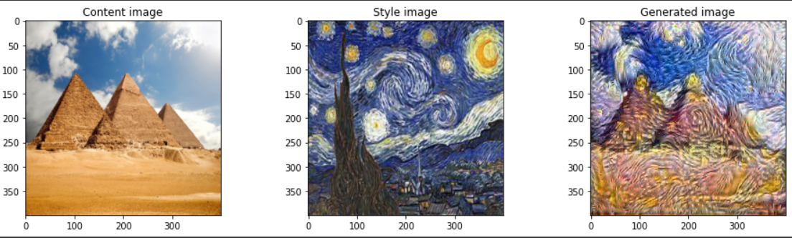
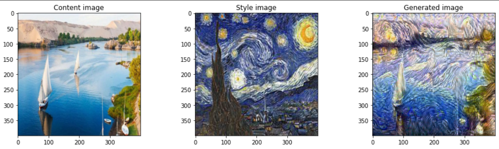
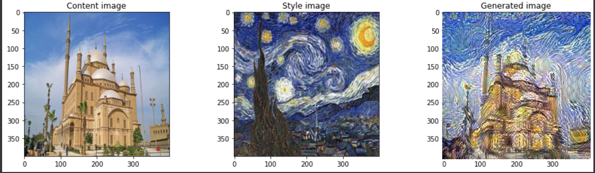
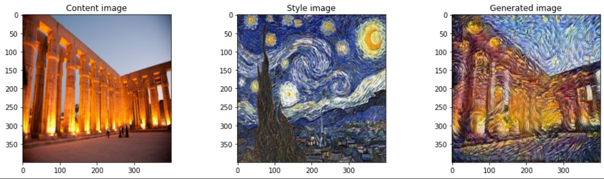
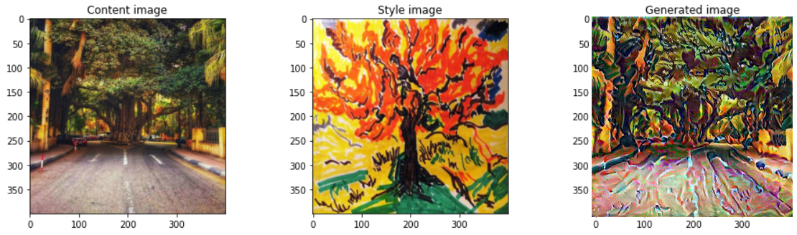

# Art-Generation-using-Neural-Style-Transfer

New Computer Vision project.

Art Generation using Neural Style Transfer.

===========================================================================

Jesse Pinkman is one of the best characters in the history of movies and series. Noone doesn't love Jesse Pinkman.
So, we will do our project to try YOLO V7 for him by choosing random shots from Breaking Bad Series.

Video Link: https://drive.google.com/file/d/15Lj3zRrEpPtUE95Hs427BPHp60QxG3lK/view?usp=sharing

===========================================================================

Results:

